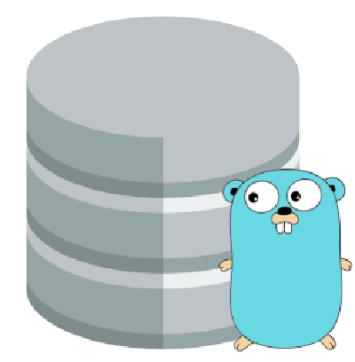

<!--
Hey, thanks for using the awesome-readme-template template.  
If you have any enhancements, then fork this project and create a pull request 
or just open an issue with the label "enhancement".

Don't forget to give this project a star for additional support ;)
Maybe you can mention me or this repo in the acknowledgements too
-->
<div align="center">

  
  <h1>GoMasterDB</h1>
  
  <p>
    Fintech project with database implementation 
  </p>
  
  
<!-- Badges -->
<p>
  <a href="https://github.com/matheuspolitano/GoMasterDB/contributors">
    
  </a>
  <a href="">
    
  </a>
  <a href="https://github.com/matheuspolitano/GoMasterDB/contributors/network/members">
    
  </a>
  <a href="https://github.com/matheuspolitano/GoMasterDB/contributors/stargazers">
    
  </a>
  <a href="https://github.com/matheuspolitano/GoMasterDB/contributors/issues/">
    
  </a>
  <a href="https://github.com/matheuspolitano/GoMasterDB/contributors/blob/master/LICENSE">
    
  </a>
</p>
   

</div>

<br />

<!-- Table of Contents -->
# :notebook_with_decorative_cover: Table of Contents

- [About the Project](#star2-about-the-project)
  * [Tech Stack](#space_invader-tech-stack)
  * [Features](#dart-features)
- [Getting Started](#toolbox-getting-started)
  * [Prerequisites](#bangbang-prerequisites)
  * [Installation](#gear-installation)
  * [Running Tests](#test_tube-running-tests)
  <!-- * [Run Locally](#running-run-locally)
  * [Deployment](#triangular_flag_on_post-deployment) -->
<!-- - [Usage](#eyes-usage)
- [Roadmap](#compass-roadmap)
- [Contributing](#wave-contributing)
  * [Code of Conduct](#scroll-code-of-conduct) -->
<!-- - [FAQ](#grey_question-faq) -->
- [License](#warning-license)
- [Contact](#handshake-contact)
- [Acknowledgements](#gem-acknowledgements)

  

<!-- About the Project -->
## :star2: About the Project


<!-- TechStack -->
### :space_invader: Tech Stack


<details>
  <summary>General</summary>
  <ul>
    <li><a href="https://sqlc.dev/">SQLC</a></li>
     <li><a href="https://github.com/golang-migrate/migrate">GO-Migration</a></li>
  </ul>
</details>
<details>
  <summary>Server</summary>
  <ul>
    <li><a href="https://go.dev/">Golang</a></li>
  </ul>
</details>

<details>
<summary>Database</summary>
  <ul>
    <li><a href="https://www.postgresql.org/">PostgreSQL</a></li>
  </ul>
</details>

<details>
<summary>DevOps</summary>
  <ul>
    <li><a href="https://www.docker.com/">Docker</a></li>
  </ul>
</details>

<!-- Features -->
### :dart: Features

- Feature 1
- Feature 2
- Feature 3


<!-- Getting Started -->
## 	:toolbox: Getting Started

<!-- Prerequisites -->
### :bangbang: Prerequisites

This project uses SQLC to automate database process

#### GO > 1.7
```bash
 go install github.com/sqlc-dev/sqlc/cmd/sqlc@latest
```

<!-- Installation -->
### :gear: Installation


```bash
  yarn install my-project
  cd my-project
```
   
<!-- Running Tests -->
### :test_tube: Running Tests

To run tests, run the following command

```bash
  make run test
```

<!-- Run Locally -->
### :running: Run Locally

Clone the project

```bash
  git clone https://github.com/matheuspolitano/GoMasterDB.git
```

Go to the project directory

```bash
  cd GoMasterDB
```


<!-- Deployment -->
<!-- ### :triangular_flag_on_post: Deployment

To deploy this project run

```bash
  yarn deploy
``` -->


<!-- Usage -->
<!-- ## :eyes: Usage

Use this space to tell a little more about your project and how it can be used. Show additional screenshots, code samples, demos or link to other resources. -->


```javascript
import Component from 'my-project'

function App() {
  return <Component />
}
```

<!-- Roadmap -->
<!-- ## :compass: Roadmap

* [x] Todo 1
* [ ] Todo 2 -->


<!-- Contributing -->
<!-- ## :wave: Contributing

<a href="https://github.com/matheuspolitano/matheuspolitano/GoMasterDB/contributors">
  
</a>


Contributions are always welcome!

See `contributing.md` for ways to get started. -->


<!-- Code of Conduct -->
<!-- ### :scroll: Code of Conduct

Please read the [Code of Conduct](https://github.com/matheuspolitano/GoMasterDB/contributors/blob/master/CODE_OF_CONDUCT.md) -->

<!-- FAQ -->
<!-- ## :grey_question: FAQ

- Question 1

  + Answer 1

- Question 2

  + Answer 2 -->


<!-- License -->
## :warning: License

Distributed under the no License. See LICENSE.txt for more information.


<!-- Contact -->
## :handshake: Contact

Your Name - [@twitter_handle](https://twitter.com/twitter_handle) - email@email_client.com

Project Link: [https://github.com/matheuspolitano/GoMasterDB/contributors](https://github.com/matheuspolitano/GoMasterDB/contributors)


<!-- Acknowledgments -->
## :gem: Acknowledgements

Use this section to mention useful resources and libraries that you have used in your projects.

 - [Shields.io](https://shields.io/)
 - [Awesome README](https://github.com/matiassingers/awesome-readme)
 - [Emoji Cheat Sheet](https://github.com/ikatyang/emoji-cheat-sheet/blob/master/README.md#travel--places)
 - [Readme Template](https://github.com/othneildrew/Best-README-Template)

